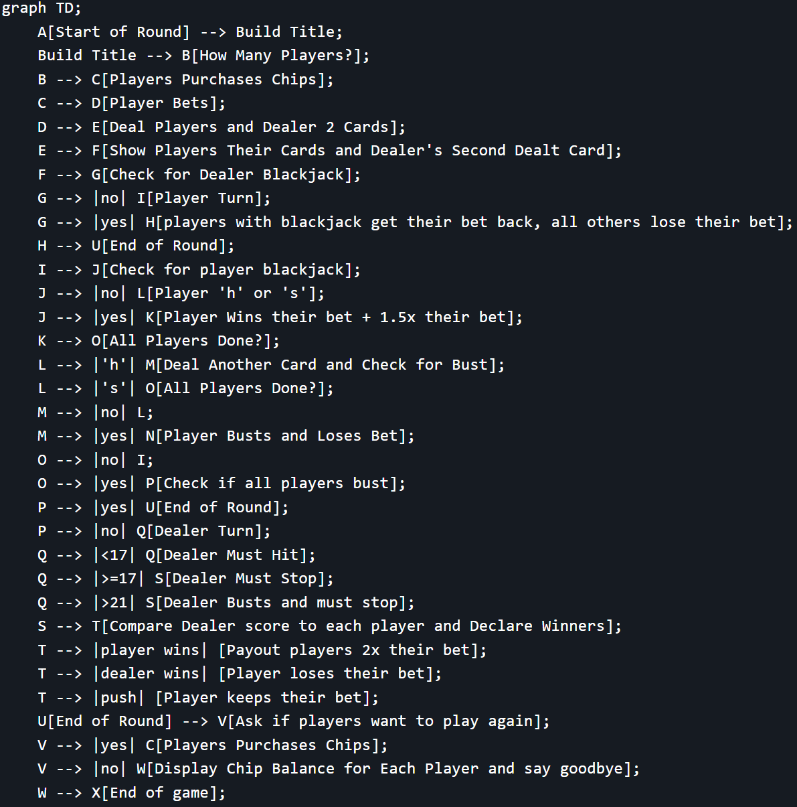

# Blackjack

## 3-2-2024

~~**NOT A WORKING VERSION YET.**~~

I made this much more extensive than the "100 days of code" assigned project on purpose. This allows me to improve my Python problem solving. I also wanted to practice better organization and documentation with markdown and mermaid for flow charts. I should be able to finish this project in the next few days.

Initial code commit. Udemy 100 days of code. Practice with:

* markdown formatting (this document compared to my previous ones is much more detailed, organized and readable)
* deepcopy
* manipulating nested dictionaries in dictionaries
* manipulating nested lists in dictionaries
* more error handling (Haven't learned classes yet, so I'm holding off on using custom exceptions for now. This will be something I can come back to work on later.)
* time.sleep()

## 3-3-2024

```FIRST WORKING VERSION. Still needs a lot of polish. This thing is a rat's nest but it works. I'll clean it up later as I learn more about Python.```

Practice with:

* placing functions in a separate file
* importing functions from a separate file
* refactoring code to be more efficient and readable

### **Flow Chart:**



### **Rules:**

* Value cards are face value, 'A' can be 1 or 11, all other face cards are 10 points each (J, Q, K)

* Highest to 21 without going over wins

* Player can hit as many times as they wish without going over 21 or stand whenever they want to stop hitting and let the other players and dealer play out their hand

* If player gets blackjack (21 on first 2 cards), they win 1.5x their bet

* If dealer gets blackjack, all players lose their bet unless they also have blackjack, then it's a push

* If player busts (>21), they lose their bet and are out of the round

* If dealer busts, all players still in the round win their bet

* If dealer and player have the same score, player keeps their bet unless previously busted

* Dealer must hit if < 17, must stop if >= 17 (unless all players bust before dealer's turn)

### **Add in Future:**

1. blackjack payout?
2. surrender option?
3. split option?
4. double down?
5. insurance?
6. AI for computer player?
    1. betting strategy?
    2. hit/stand strategy?
7. betting limits?

### **To-Do:**

1. ~~Error handling for invalid bets (rounded float) & (bet > chip balance)~~
2. ~~Error handling for invalid player count (int)~~
3. ~~Error handling for invalid chip purchase amounts (float) & (rounded)~~
4. ~~Error handling for invalid player names~~
5. ~~Error handling for invalid player actions~~
6. ~~Fix value of "A" card to be 1 or 11 (currently only 11)~~
7. ~~Move all functions to a different .py file (I'll have to look this up)~~
8. Polish up the code and make it more appealing during gameplay
    1. format currency to 2 decimal places
    2. format player names to be capitalized
    3. add player actions such as "hitting" and "standing" to be more descriptive
    4. update dealer actions to be more descriptive
9. Refactor code to be more efficient and readable

### **Bugs:**

* ~~Game ends if dealer gets blackjack on first 2 cards, but the round should end, not the game.~~
* ~~a bet of zero is permitted. this should not be allowed.~~
