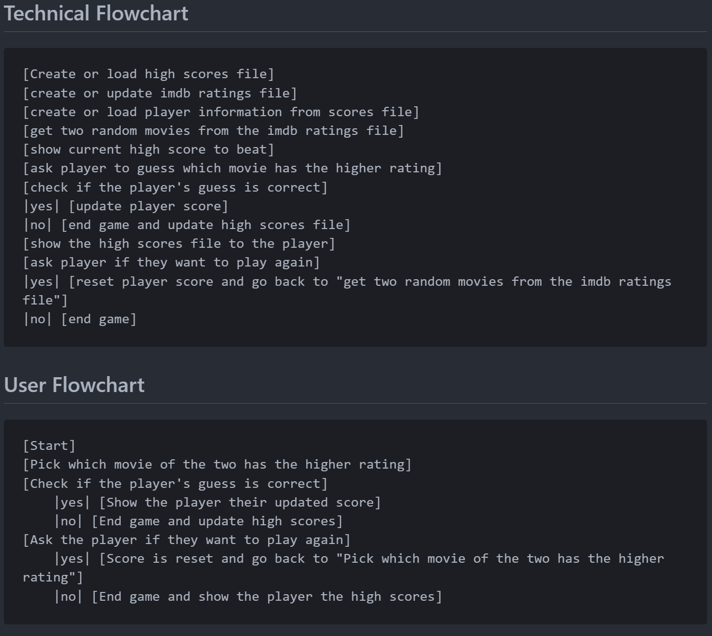

# HIGHER-lower

## Description

### **Rules**

The rules are simple:

* The game will present the player with two movies and the player will have to guess if the second movie has a higher or lower rating than the first movie.

### Dependencies

* python

* pip install IMDbPY or pip3 install IMDbPY (depending on your system)

## Installation

* Install the listed dependencies. Download the files and run the main.py file.

* If you alter the "movies.json" file, be sure to remove any empty lines from the file. The program will not work if there are any empty lines.

* The program will create a "scores.json" file and a "ratings.json" file if they do not already exist.

## Dev Log

### 3-6-2024

~~**NOT A FULL WORKING VERSION YET.**~~

I made this much more extensive than the "100 days of code" assigned project on purpose. This allows me to improve my Python problem solving.

Although I have never used APIs or file I/O, I will be I will be learning how to use them in this project. I will start with using a json file for both the scores and movie ratings files, but might learn how to use a database later on and switch to that.

Initial code commit.
New concepts that I am wanting to learn in this project are:

* file I/O - reading and writing to files &#10003;

* creating files and directories &#10003;

* version control of files (i.e. creating a backup of a file at the beginning of the program.)
  * I will be manually writing the code to create a backup of the high scores file at the beginning of the program (for practice).
  * Later on, I will consider using the *shutil* module to for this process instead.

* working with json syntax &#10003;

* working with APIs &#10003;
  * using the IMDbPY library to get movie data from IMDb &#10003;

* gathering the date and formatting it &#10003;

Additionally, I would like to focus on using functions to **return** values instead of altering global variables and/or using **print** statements within the function to display the value. I feel like this would help with readability/organization and make the code more modular. (I kind of got carried away figuring out how other things work and I don't feel like I did a good job of this again. I will try to focus on this more in the future or rework this project later.)

### 3-7-2024

Things I accomplished today:

* Added highscore board to the end of the game.

My code is still clearly a rat's nest. I need to work on this. I also need to work on my use of functions. I am also not using them as effectively as I should be. I need to work on this. I hope I fix this soon because I'm sure it will only get worse as I get further into OOP and the programs get more complex. Found a bug in the code where movies are slipping by the check for a rating and staying in the database without metadata. I think adding each individual movie to the database after it has been checked for metadata will prevent this. I currently have it "mass" updating.

### 3-8-2024

Things I accomplished today:

* Addressed the last item on the **To-Do** list "Remove previously used movies from the options to use in the game but what happens when all the movies have been used?"

* Reworked the the code to add movies to the database after it has been checked for metadata. This should prevent me from ever having to remove a movie from the database. Also learned more about exception handling and how to prevent inevitable API timeout errors from being displayed in the console. This rework fixed every bug I had listed in the "Bugs" section.

### 3-11-2024

**FULL WORKING VERSION.**

I guess I forgot to mention that this is a full working version. It isn't the greatest but it works!

### **Flow Chart**

### **Add in Future**

* Remove IMDbPY dependency to only be a dependency if the user wants to update the ratings database

* Add a way to update the ratings database from the command line (if IMDbPY is installed and I change the code to allow for this.)

* Progress bar for updating the ratings database

* [x] add a high scores chart to the game

### **To-Do**

### **Bugs**

* ~~some movies are slipping by the check for a rating and staying in the database without metadata. I need to find a way to guarantee that the movie has all the metadata before it is added to the database and if it doesn't, I need to find a way to remove it from the database. (I think I will need to rework the code to add the movie to the database after it has been checked for metadata. This would prevent me from ever having to remove a movie from the database.)~~

* ~~While updating the "ratings" database, the program will sometimes error out and not update the database. It throws a timeout error. I believe this might be the api call timing out. I will need to add a try/except block to handle this error or find a way to prevent it from happening.~~
  * ~~I could potentially call a separate python program to update the database separately from the main game program. (I feel like this option allows for more flexibility and control over the process. I could also potentially run two programs at once. I assume this would be possible? I will have to look into this more.)~~
  * ~~I could also try increasing the timeout time for the api call if that is available.~~
  * ~~I could also try to retry the request if it times out.~~
  * ~~I could also reprogram the code to update the database "per" movie instead of all at once. This would allow me to update the database in smaller chunks and potentially prevent the timeout error from happening OR at least make it capable of skipping the movie that caused the error and continue updating the database.~~

* ~~The code initially searches for the movie by its title and selects the first result. If this selection does not have a rating, the program will error out. I will need to add a try/except block to handle this error or find a way to prevent it from happening.~~
  * ~~Known movies to not work with IMDbPY for this game:~~
    * ~~Rogue One: A Star Wars Story (because it selects the wrong movie from the search results)~~
  * ~~I could potentially add a check to see if the movie has a rating before trying to use it in the game. If it does not have a rating, I could skip it and move on to the next movie OR find a way to make the search result selection "smarter".~~