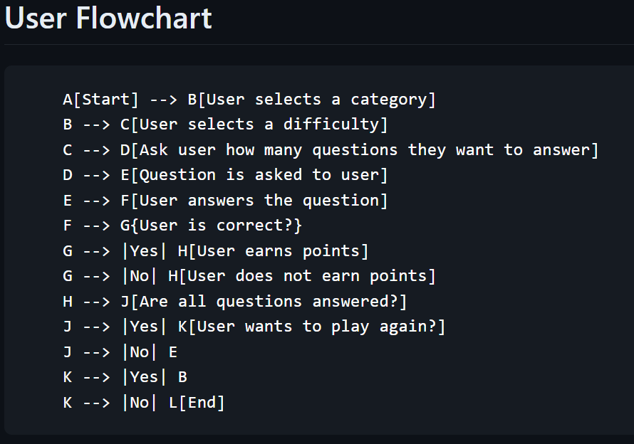

# Quiz Game

## Description

### **How to play**

Answer the question correctly to earn a point. The game will keep track of your score. You can select the category and difficulty of the questions you want to answer.

## Installation

No installation required. Just download/clone the repository and run the 'main.py' file.

## Dev Log

### 3-9-2024

~~**NOT A WORKING VERSION YET.**~~

New concepts im using:

* Most importantly... classes and objects. Finally.

* ~~**MAYBE** -~~ Direct API calls on the fly from opentbd.com while the game is being played instead of using a library's API to store data in a project database. After roughing through using APIs on my last project, I looked a bit more into the API documentation of opentdb.com and I feel like there is a lot of potential for me to learn a lot more about APIs here because the documentation is simple and straightforward without a ton of options.

* If I use the opentdb.com API, I think I might have to decode base64 strings. That would be new to me. It's probably a simple function, so I'm not worried about it.

* I'm probably not going to add many new learning concepts to this project, but i will be using the ones i already know hopefully in a more efficient way than i have in the past. I feel like I spent a lot of time on the last project just trying to figure out how to do things when I really need to start working on good coding practices. I can come back later to implement new concepts after I have "officially" learned them.

### 3-11-2024

**FULL WORKING VERSION.**

Classes seem like they are going to make projects a lot easier to manage. Direct API calling isn't bad either. I'm not too worried about storing stats, game saves, etc right now. I know I can get by if I need to but I need to keep progressing with Python concepts. I can come back to it later. I just want the game to work right now and I can add complexity later. KISS.

I am considering skipping error handling for now as well. I know it's important for a working version, but again... I know I can get by but I can come back to it later. I just want the game to work for now.

I had to put a sleep timer between the "True or False" printout and the actual question as a band-aid fix for the API call limit of 5 seconds. If the player answers too quickly, the game will crash. I know this definitely isn't the best way to handle it but I still have more to learn and that's lower on my priorities at the moment. It still shows a response code of 200 before I can check for the Code 5 that the API returns (which indicates a request was made too fast), but it works for now.

### **Flow Chart**

### **Add in Future**

* Save game stats to a file or database.
* Add a timer to the game.
* Multiple choice questions.

### **To-Do**

* Implement error handling of APIs and user input.
* Implement a token reset if it returns code 4 (no more questions in category). Running out of questions would be difficult, so this isn't a priority right now. 24 categories and the lowest category has 125 questions, highest has 4568 at the time of writing this.
* Implement a better way to handle the delay between questions when I request from the API too fast. The current sleep timer is a band-aid fix.

### **Bugs**
