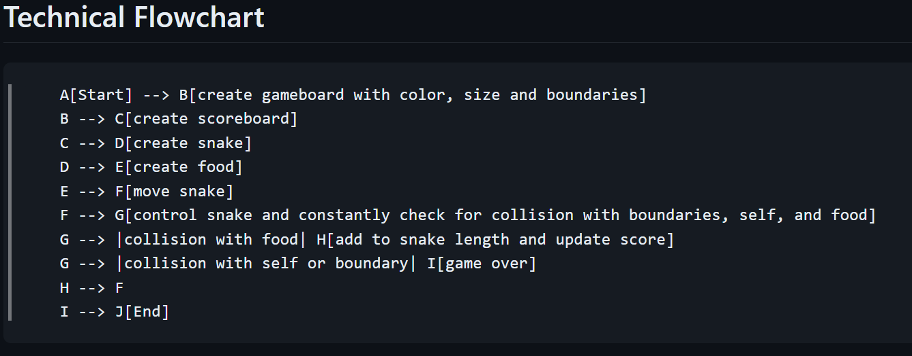

# Snake

## Description

### **How to play**

Stay within the boundaries and eat the food to grow. Don't run into the walls or yourself. Use "w" "a" "s" "d" to move up, left, down, and right respectively. Change the color of your snake with the "c" key.

## Installation

No installation required. Just download/clone the repository and run the 'main.py' file.

## Dev Log

### 3-14-2024

~~**NOT A WORKING VERSION YET.**~~

New concepts im using:

Not really any. Just trying to get better at modularizing my code. This was another rat's nest and complex code, but I think I did a better job at separating the classes from one another. Last project had several dependencies between classes, but this one has none or very few. Again, the complexity of code is still high, but I also know that there are better "shorthand" ways to do things. I'm just not there yet. I'll focus on that after I feel like I have all the basics down.

Also, learned a HUGE lesson that had me stumped for a while. My snake would noticeably slow down more and more each time it grew. It seemed like the code was bogging down, but I couldn't figure out why. Turns out that there is a tracer() function in the turtle module that allows the screen to not update until told to do so in the code. The snake no longer slows down.

I'll add the collision detection for the snake hitting itself tomorrow and then call it a working version and commit it to the repo.

### 3-15-2024

**FULL WORKING VERSION.**

Oh boy... My code looks WAYYYYYY too complex for what it is. I kind of like that though because I know I will look back and realize how much I've learned when I get the fundamentals down and try treating some of these projects like production projects. Throw on Github Copilot as well and we'll be flying.

There were a couple things in the game that had me stumped for a bit but I got through it. One thing that got me at least twice was checking positions against another position. You would think the math comes out that "20 = 20" but it doesn't sometimes. Sometimes it comes out "20.0000000000000001 = 20" and that's a problem because they aren't equal. I had to use the round() function to fix that. It first got me on the food detection, then got me on the self collision detection. Sneaky sneaky!

Threw in a very quick "random color change" button as well just to see if I could do it within a few seconds. Later, I can add a menu to personalize things.

Notes after watching the course video:

* Turtle() is a class that I could've inherited from to make my own class. I haven't worked with inheritance and didn't put that together. I know that for future projects now.

* I watched a video earlier today about how to "Be a Better Programmer Than 99% of Other Programmers" earlier and a key point stuck out. I started thinking to myself... This makes sense but I don't think I can sit and read an encyclopedia-sized document of information. Well, I missed a big one here with the Turtle documentation. I did look things up as I went, but I didn't read the whole thing OR at least skim through the primary methods. I missed the turtle.distance() method that would've made my collision detection SO much easier. In short, read the documentation of the modules you're using. They are probably not as long as you think and you'll learn a lot.

* I repeated a lot of code... I'll just say that. Things like fonts, dates, colors, etc could have been assigned to constants and used throughout the code instead of typed out each time.

* Didn't know about slicing. I could've used that to make my code cleaner in a few places. Noted for future use in projects for practice.

### **Flow Chart**

### **Add in Future**

* IDEA: snake has to match color of food to eat it? I'm sure this has probably been done, but a cool little twist.
* IDEA: snake has to match color of wall on a much larger map to pass through it? Again, probably been done, but a cool little twist.
* IDEA: snake can "spit venom" to collect food from a distance? Again, probably been done, but a cool little twist.
* pause menu
* color change for bg
* selectable color change for snake

### **To-Do**

### **Bugs**
