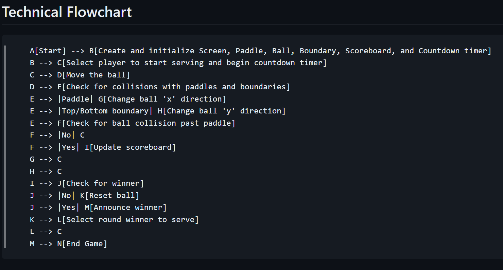

# Pong

## Description

The classic game of Pong.

### **How to play**

Control your paddle with the arrow keys to make sure the ball doesn't get past you. Currently, you control both paddles. If I learn how to make a computer controlled paddle or online multiplayer against your friend, I will add that in the future.

## Installation Instructions

None. Just download the repo and run the main.py file using python.

## Dev Log

### 3-19-2024

~~**NOT A WORKING VERSION YET.**~~

New concepts im using in this project:

* Class inheritance

Additional notes:

Trying to keep this one relatively simple while still adding in extras that aren't required from the course. Trying to also make the code adaptable for any screen size, making the game quite a bit different depending on height/width of canvas. This allows for me to come back later and give options to the player to spice things up a bit instead of a standard 800x600 game every round.

### 3-20-2024

Finished up a **WORKING VERSION**. I did end up using a lot of logic in the main.py but I didn't want to have any cross-class dependencies. I'm not sure how much of that is okay, but I wanted to avoid it for now. I did end up passing in the screen turtle to the ball class so it would update() during the countdown timer between rounds. Once again, I feel like this could be significantly imporoved but I need to move on to the next project for now.

### **Flow Chart**

### **Add in Future**

### **To-Do**

### **Bugs**
