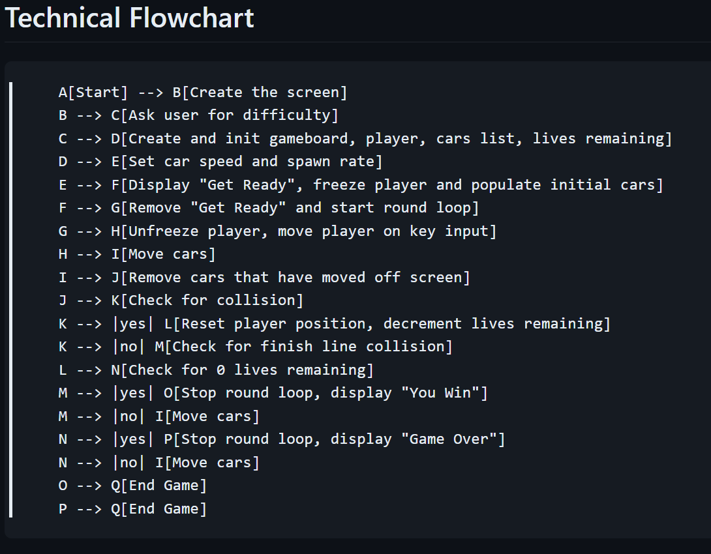

# Turtle Crossing

## Description

### **How to play**

The player controls a turtle that must cross a busy road. The turtle must avoid cars. The turtle can move up and down. The cars move from right to left. The game ends when the turtle collides with a car or successfully crosses the road. 

## Installation Instructions

None. Just download the repo and run the main.py file using python.

## Dev Log

### 3-20-2024

**FULL WORKING VERSION**

New concepts im using in this project:

* None. This is a capstone project that allows for practice with the other concepts I have learned recently. I want to try to improve on keeping classes independent and less code in the main.py file.

Additional notes:

I will be not watching any "follow along" videos until after I have complete this project. I will be using the concepts I have learned recently to create this game from scratch at a reasonable pace. I want to keep it simple and knock it out so I can move on to the next Python concepts.

Update a couple hours later:

I finished this one faster than I expected with how many options I added to it. About to watch the "walkthrough" video to see how my code compares to the instructor's. I'm sure their code is more efficient but mine allows for many variables that probably weren't necessary, such as screen size adaptability and various difficulty settings (spawn rates, speeds, etc).

Update after watching the walkthrough:

I was correct that mine is probably better in a few ways. One thing I missed while coding was creating "constants" instead of keeping my constants in the object itself. I would have only used one or two but regardless, I need to remember that in the future.

### **Flow Chart**

### **Add in Future**

* "START -->  <-- START" on the screen where player starts
* "FINISH -->  <-- FINISH" on the screen where player finishes
* cars both directions
* turtles on the sidelines
* multiple rounds, each progessively harder depending on difficulty setting

### **To-Do**

### **Bugs**
