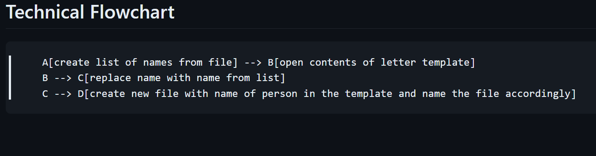

# Mail Merge

## Description

### **How to use**

Type the names of the people you want to send the email to in the `names.txt` file. Then type the email you want to send in the `letter_template.txt` file. Run the program and it will create a new file for each person in the `output` sub-folder.

## Installation Instructions

No installation required. Just run the program.

## Dev Log

### 3-21-2024

**FULL WORKING VERSION.**

New concepts im using in this project:

* Manipulating multiple text files.

* Replacing specific text in a file with text from a different file. The `.replace()` method.

* Creating new files of the product and outputting them to a new folder.

Additional notes:

I worked with opening and closing files in the `009_HIGHER_LOWER` project, so this might not be too bad.

Update after completion:

That was way easier than expected once I looked through and found the `replace()` method. Also, after watching the project video, I learned about `strip()` and `readlines()`. I might try those out in a future project.

### **Flow Chart**

### **Add in Future**

### **To-Do**

### **Bugs**
