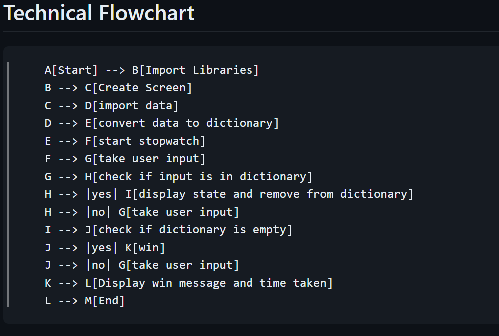

# States Quiz

## Description

### **How to use**

You will see a map of the United States with a prompt to enter the name of a state. If you enter the correct name of a state, the state will be highlighted on the map. If you enter the wrong name, the program will tell you that you are wrong and ask you to try again.

## Installation Instructions

Install the `pandas` library according to your operating system. This is most likely done by running `pip install pandas` in your terminal.

## Dev Log

### 3-22-2024

New concepts im using in this project:

* `pandas` library and csv files with python
* more `turtle` library concepts
* `del` function

Additional notes:

I want to create the base project and purposely wait to add a couple of features afterwards, like a score system and a timer. This will teach me a bit more about modular programming and how to add features to a project after the base project is done. If I do well at modular programming, it should be easy. Otherwise, it will be a good learning experience.

Update:

Didn't take long to complete. Created the base program by converting the csv to a dictionary and then using the turtle library to display the map and mark the states as they are guessed. I will add the score system and timer in the next version.

Update:

Added a scoreboard by switching screen height/width to a constant and updating the window size to allow for a scoreboard. I also added a scoreboard class to keep track of the score and display it on the screen. Now, I will add a timer.

Update:

Instead of a live timer, I opted for an end-of-game timer that shows you how long it took you to complete the game. If I added a live timer, I would probably add in a `while` loop that constantly refreshes the screen by using `tracer()` and `update()` functions and then calculate the new time on each loop. I will add a live timer in a later version.

With this much complete, it took me 1 hour, 15 minutes to complete. That includes a couple detours to look up how to do certain things like looking up how to use the `time` library and `del` function. Not too shabby I guess. That is much better than some of the other projects I have done.

Update:

Well... The project was pretty quick until this part, but I got it done. The game now saves the state of your last session. When you start the game, it will ask if you would like to start a new game or load previous session if you had one. I added the `FileHandler` class to take care of a lot of this. I might have done it in an inefficient way, but I am happy with the result for now.

### **Flow Chart**

### **Future Updates**

* add a live timer
* code refactor

### **To-Do List for Next Working Version**

### **Bugs**
