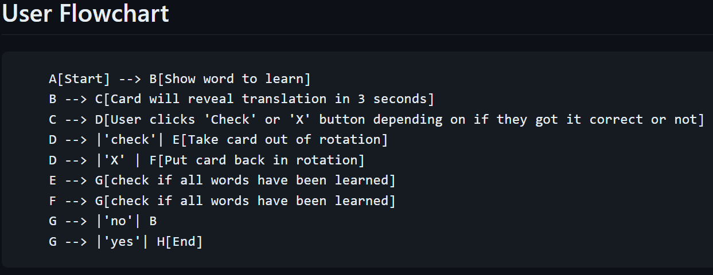

# Flashcards

## Description

### **How to use**

1) A word will appear on the screen for you to learn and you have 3 seconds to translate it in your head
2) The translation will appear on the screen
3) Click 'Check' if you got it correct or 'X' if you got it wrong
4) The card will be removed from the rotation if you click 'Check' and put back in rotation if you click 'X'

## Installation Instructions

None. Just run the `main.py` file.

## Dev Log

### 3-30-2024

**NOT A WORKING VERSION YET.**

New concepts im using in this project:

* Most likely there will technically be nothing "new" in this project. I will be using the same concepts as before, but there might be new things later.
* Kind of `lambda`... I don't completely know how they work yet. I found it in the `pandas` documentation for binding a function to a button. Seems like an in-place function call.

Additional notes:

I am taking this project further than the course instructs me to. I plan on adding additional features to make it less "plain" and more user-friendly.

### 4-1-2024

Can't lie, I am struggling right now. I am doing okay for the most part but I got tripped up at the `move_word` function. I need to get better with `pandas` manipulation because I feel like there is a much easier way to move the word from the original list to another while keeping it ready to save to a new file that can be read later. The file is going to need to match the original file so that the program can be uniform. It's super late so maybe I can sleep on it or do a bit more research on `pandas` tomorrow. Regardless, I believe I am done with the base UI and the basic functionality of the program. I just need to get the `move_word` function working and then I can move on to the next part of the project, which will be checking for the end of the list as well as saving the progress.

### 4-6-2024

Okay... Went back to kind of get a better grasp on the `pandas` library. It makes a lot more sense now and I feel like I can accomplish this project without the "100 Days of Code" section videos. I am completely recoding the entire project from scratch. A lot of it will be the same, but it's really just to get back in the groove of coding since I haven't had time this week.

Update:
Deleted everything and starting over was kind of nice. I have not been using co-pilot for this entire course, but I also went ahead and turned off suggestions before I started recoding this project. It was nice to see that I could do it without the suggestions, but I also know that I can use it if I need to. I will continue to do things this way for now. I haven't done anything with `pandas` yet, but I still got a bit further with other things than I did before. I plan on hitting the `pandas` stuff next time.

### 4-8-2024

Imported the word list and made it to where any previously saved word is removed from the pool of available words. Words are appended to the save file as you go, so no need to hit a save button. I added a `clear save file` button that does what it says and also closes the window. This is because I haven't coded it to handle clearing the save file while the program has already initiated. Things get a bit funky if I don't force the user to reset the program. I am okay with this for now.

This project is not modular but I am okay with that for now. I am not going to perfect this project since I obviously need to move on to new concepts. I kind of set this project up to be an interesting one in the future when I revisit it. The project is somewhat ready for an additional language and it would be neat to have a menu to select the language and quantity of words to learn. Still need to implement a ton of error handling later.

### 4-9-2024

Update after watching the course solution videos:
I learned that you can create a `Button()` and use an image for it. I was creating a `Canvas`, adding a `PhotoImage()`, and binding a mouse click to the canvas. I believe I did that on the `018_POMODORO` project and that's why I assumed that was the correct way to do it. Knowing this would've saved so much time. Their approach was also using a list of dictionaries, but I intentionally wanted to use the dataframes directly.

### **Flow Chart**

### **Future Updates**

* language selection
* word count selection
* start button
* end button
* percentage of words correct on first try, second try, and third+ tries when the user is done learning

### **To-Do List**

### **Bugs**
